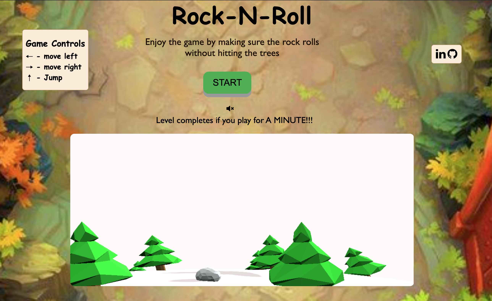

# Rock-N-Roll

[Live Game](https://knandhu.github.io/dist/)

# Table of Contents

  1.Introduction
  
  2.Features
  
  3.Technologies

  4.Future Enhancements

# Introduction
  
   Rock-N-Roll, is a 3D game with Rock moving on the mountainside with trees as obstacles. 
Controller to move the rock left/right makes the player to move the rock without hitting the trees to continue the game. It's an endless loop game and the player wins if they continue playing the game for a minute.

  
# Features

* 3D scene of a stage with sliding Rock, mountain environment with trees.
* User interaction to move the rock left, right and jump.
* Game over logic based on collision of rock with tree.


 
 
## Adding trees

* Trees will get added as we move onto the endless runner loop.

```javascript
function addPathTree() {
  var options = [0, 1, 2];
  var lane = Math.floor(Math.random() * 3);
  addTree(true, lane);
  options.splice(lane, 1);
  if (Math.random() > 0.5) {
    lane = Math.floor(Math.random() * 2);
    addTree(true, options[lane]);
  }
}
```

## To create HeroSphere

* Rock, which is rolling on the mountain is created by using below logic and the camera and sphere has been fixed in mountain environment.

```javascript
function rock() {

  var sphereGeometry = new THREE.DodecahedronGeometry(heroRadius, 1);
  var sphereMaterial = new THREE.MeshStandardMaterial({
    color: 0xe5f2f2,
    flatShading: THREE.FlatShading,
  });
  jumping = false;
  heroSphere = new THREE.Mesh(sphereGeometry, sphereMaterial);
  setTimeout(function () {
    // heroSphere.material.emissive.setRGB(255, 0, 0);
  }, 100);
  heroSphere.receiveShadow = true;
  heroSphere.castShadow = true;
  scene.add(heroSphere);

  //moving rock
  heroSphere.position.y = 6.8;
  heroSphere.position.z = 2.8;
  currentLane = middleLane;
  heroSphere.position.x = currentLane;

  camera.position.z = 7.5;
  camera.position.y = 2.5;
  camera.position.x = 0.5;
  
}
```

## User Interaction Logic

* Users' interaction is handled by using the below logic.

```javascript
function handleKeyDown(keyEvent) {
  if (jumping) return;
  var validMove = true;
  if (keyEvent.keyCode === 37) {
    //left
    if (currentLane == middleLane) {
      currentLane = leftLane;
    } else if (currentLane == leftLane) {
      currentLane = leftmost;
    } else if (currentLane == rightmost) {
      currentLane = rightLane;
    } else if (currentLane == rightLane) {
      currentLane = middleLane;
    } else {
      validMove = false;
    }
  } else if (keyEvent.keyCode === 39) {
    //right
    if (currentLane == middleLane) {
      currentLane = rightLane;
    } else if (currentLane == rightLane) {
      currentLane = rightmost;
    } else if (currentLane == leftmost) {
      currentLane = leftLane;
    } else if (currentLane == leftLane) {
      currentLane = middleLane;
    } else {
      validMove = false;
    }
  } else {
    if (keyEvent.keyCode === 38) {
      //up, jump
      bounceValue = 0.12;

      jumping = true;
    }
    validMove = false;
  }
  //heroSphere.position.x=currentLane;
  if (validMove) {
    jumping = true;
    bounceValue = 0.06;
  }
}
```

## Game over Logic 

* Whenever the rock hits tree will update the score and in turn using score to detect the end of the game.

```javascript
  if (treePos.z > 6 && oneTree.visible) {
      //gone out of our view zone
      treesToRemove.push(oneTree);
    } else {
      if (treePos.distanceTo(heroSphere.position) <= 0.4) {
        hasCollided = true;
        score = -1;
        scoreText.innerHTML = score.toString();
      }
    }
```


  
# Technologies

* Three.js


# Future Enhancements

* Implement more levels
* User to select on the environment to play the game, mountain with rain, fog effects


